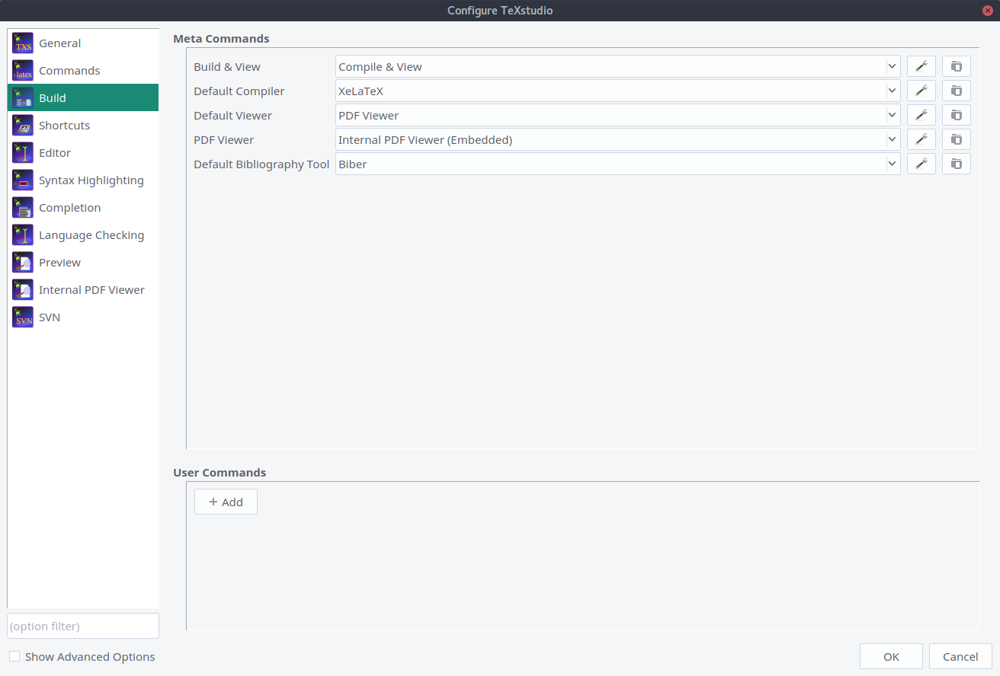
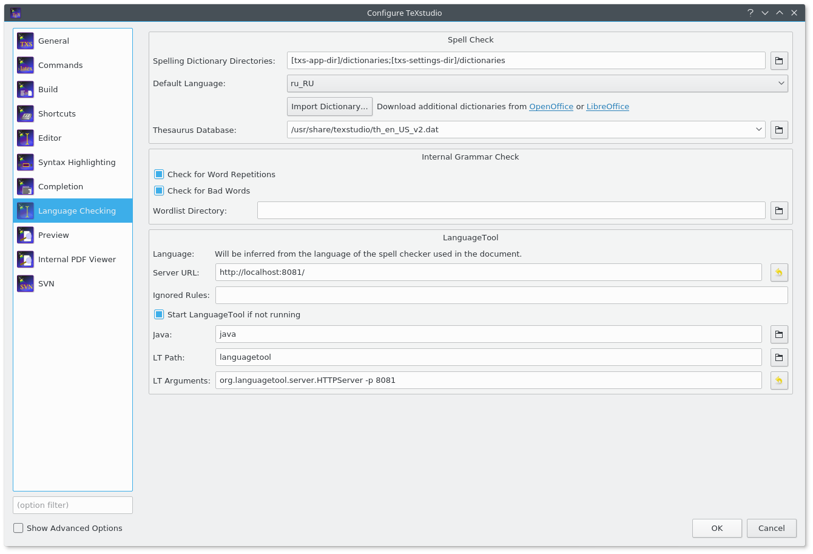

# Шаблон работ для студентов ФИИТ Института Математики, Механики и Компьютерных Наук им. Воровича

[](https://github.com/sanyarnd/sfedu-mmcs-latex-thesis-template/actions/workflows/build.yml)

[Текущий шаблон](https://github.com/mmcs-sfedu/mmcs_sfedu_thesis)

Альтернативный шаблон для курсовых и выпускных работ студентов ФИИТ ИММиКН им. Воровича.

Варианты работ: курсовая, ВКР бакалавра, магистерская диссертация. Также есть пример презентации (`presentation/`) и отзыва о практике (`reference.tex`).

Собранные PDF: [релизы](https://github.com/sanyarnd/sfedu-mmcs-latex-thesis-template/releases) или артефакт `pdf` на странице [Actions](https://github.com/sanyarnd/sfedu-mmcs-latex-thesis-template/actions/workflows/build.yml).

Без локальной установки `LaTeX` можно работать в `Overleaf`: достаточно разделов [Overleaf](#overleaf) и [Как пользоваться](#как-пользоваться).

[Шаблон в `Overleaf`](https://www.overleaf.com/read/prpvyzswtpbr), в меню слева есть кнопка `Copy project`.


## Зависимости
`TeX Live` 2023 или новее, `XeLaTeX` и `biber`. Шрифты лежат в `fonts/`, устанавливать их не нужно.

### Установка TeX Live
#### Windows и macOS
[Установщик TeX Live](https://www.tug.org/texlive/acquire-netinstall.html), для macOS — [MacTeX](https://www.tug.org/mactex/).

#### Linux

##### Ubuntu, Debian, Mint
```sh
sudo apt install texlive-full
```

##### Arch
```sh
sudo pacman -S texlive texlive-langcyrillic texlive-bibtexextra biber
```

##### Fedora
```sh
sudo dnf install texlive-scheme-full
```


## Сборка
Порядок сборки: `xelatex` → `biber` → `xelatex` ×2. Это делает `latexmk` с настройками из `.latexmkrc`.

### Overleaf
`Menu` → `Settings`: `Compiler` — `XeLaTeX`, `Main document` — `diploma.tex`.

### TeXstudio
`Options` → `Configure TeXstudio` → `Build`:
* `Default Compiler`: `XeLaTeX`;
* `Default Bibliography Tool`: `Biber`.



#### LanguageTool
Проверка орфографии и грамматики: [LanguageTool](https://languagetool.org/ru/) (нужна Java). В `Language Checking` укажите `Server URL` — `http://localhost:8081`, `LT Path` — путь к `languagetool-server.jar`, `Default Language` — `ru_RU` ([словарь](https://extensions.libreoffice.org/en/extensions/show/russian-dictionary-pack)).



### VS Code
Расширения [LaTeX Workshop](https://marketplace.visualstudio.com/items?itemName=James-Yu.latex-workshop) и [LTeX+](https://marketplace.visualstudio.com/items?itemName=ltex-plus.vscode-ltex-plus) для орфографии.

### Командная строка
```sh
make              # diploma.pdf
make watch        # пересборка при сохранении
make all          # плюс презентация и отзыв
make test         # проверки
make clean
```


## Как пользоваться
Впишите свои данные в `\filltitle` в `diploma.tex`. Главы лежат в `items/` и подключаются через `\include` (с новой страницы) или `\input` ([разница](https://tex.stackexchange.com/a/32058/72742)). Не используйте кириллицу и пробелы в именах файлов.

Первая строка каждого файла, `% !TEX root = ../diploma.tex`, указывает корневой документ, поэтому компилировать можно из любого файла.

Изображения кладите в `images/`: файл `images/chap01/image.png` подключается как `\includegraphics{chap01/image}`. CSV-данные для таблиц и графиков — в `data/`.

### Тип работы
Опция класса: `\documentclass[bachelor|coursework|master]{sfedu-mmcs-thesis}`. В магистерской главы оформляются через `\chapter` ([требования](http://it.mmcs.sfedu.ru/docs/IT-papers-2015.pdf)).

Введение и Заключение: `\unnumbered{Введение}` — подходит для любого типа работы.

### Титульный лист

| Параметр | Описание |
|---|---|
| `title` | Название работы |
| `sex` | `male` или `female` (Студента / Студентки) |
| `course` | Курс |
| `author`, `authorgenitive` | Автор в именительном и родительном падеже |
| `supervisor`, `supervisorPosition` | Научный руководитель и его должность |
| `reviewer`, `reviewerPosition` | Рецензент (только для магистерской) |
| `chairHead`, `chairHeadPosition` | Руководитель направления (только для ВКР бакалавра) |
| `programCode`, `programName` | Код и название направления подготовки |
| `year`, `city` | Год и город |
| `titlepage` | Готовый PDF титульного листа вместо шаблонного |

### Оформление
Поля, шрифт, интервалы и подписи настроены по ГОСТ 7.32-2017, список литературы — по ГОСТ Р 7.0.5-2008. Пакеты подключаются в `packages.tex`, настройки списков, листингов, теорем и единиц измерения — в `commands.tex`.


## Проверки
`make test` собирает все документы и падает, если в логах есть предупреждения (битые ссылки, выход строк за поля и т.п.) или в PDF нет ожидаемого текста. Нужны `latexmk` и `poppler-utils`. Это же запускается в CI на TeX Live 2023 и последней версии.


## Стандартные ошибки при работе с LaTeX
* **Отсутствуют пакеты.** `tlmgr install <пакет>` или пакет `texlive-*` дистрибутива.

* **Нет списка литературы.** Запустите `biber` (в TeXstudio: `Tools` → `Bibliography`) или собирайте через `latexmk`.

* **`??` вместо номера ссылки.** Скомпилируйте ещё раз: ссылки, содержание и библиография собираются за несколько проходов. Если не помогло — метки с таким именем нет.

* **Источника из `biblio.bib` нет в списке.** Выводятся только процитированные; для всех — `\nocite{*}`.

* **Ошибка при вставке .jpg/.png.** Пересохраните изображение.

* **Долгая сборка.** Обновите кеш шрифтов: `fc-cache -f`.
