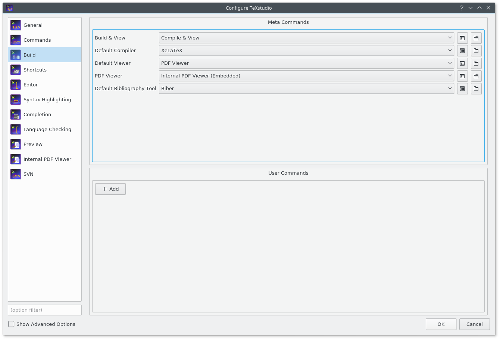

# Шаблон работ для студентов ФИИТ Института Математики, Механики и Компьютерных Наук им. Воровича

[Текущий шаблон](https://github.com/mmcs-sfedu/mmcs_sfedu_thesis)

Альтернативный шаблон для курсовых и выпускных работ студентов ФИИТ ИММиКН им. Воровича.

В шаблоне присутствуют следующие варианты работ:
* Курсовая работа в конце третьего курса
* Отчет о преддипломной практике
* Выпускная квалификационная работа (бакалавриат)
* Магистерская диссертация (требует проверки)

Дополнительно в файле `reference.tex` содержится пример отзыва прохождения производственной практики (бакалавриат).

Если вас не интересует оффлайн установка дистрибутива `LaTeX`, то есть возможность облачной работы при помощи сервиса `Overleaf`. В этом случае из инструкции вам следует прочесть только пункт [`как пользоваться`](#Как-пользоваться).

[Шаблон в `Overleaf`](https://www.overleaf.com/13026548prrmzysxpfzz)

# Содержание
* [Зависимости](#Зависимости)
    * [Установка TeX Live](#Установка-tex-live)
      * [Windows](#windows)
      * [Linux](#linux)
* [Настройка TeXStudio](#Настройка-texstudio)
    * [LanguageTool](#languagetool)
* [Как пользоваться](#Как-пользоваться)
* [Стандартные ошибки при работе с LaTeX](#Стандартные-ошибки-при-работе-с-latex)
* [Прочие ошибки](#Прочие-ошибки)

## Зависимости

Основные зависимости:
* Текстовый редактор [[1](https://www.gnu.org/software/emacs/), [2](https://code.visualstudio.com/), [3](https://atom.io/)] (возможно потребуется установка доп. плагинов!) или специализированная программа [[1](https://www.texstudio.org/), [2](http://www.xm1math.net/texmaker/), [3](http://www.texniccenter.org/), [4](http://www.tug.org/texworks/)].
* Компилятор `XeLaTeX`
* Система управления библиографией `Biber`

Шрифты _(при необходимости используемые шрифты можно изменить в [`.cls`](https://github.com/sanyarnd/sfedu-mmcs-latex-thesis-template/blob/master/sfedu-mmcs-thesis.cls#L111) файле)_:

* [Free Fonts](https://www.gnu.org/software/freefont/)
* [XITS Math](https://fontlibrary.org/ru/font/xits-math)

Для получения данных зависимостей потребуется дистрибутив `LaTeX` _(все пакеты можно скачать и заставить работать по отдельности, но это достаточно сложно и не нужно)._

Перечень пакетов:

_`XeLaTeX` и `Biber` используют `UTF-8` (поэтому исключаются проблемы с кодировкой и смешиванием языков) и не требуют дополнительных пакетов для поддержки мультиязычности._

* Обязательные пакеты
  + [amscd](https://ctan.org/pkg/amscd)
  + [amsfonts](https://ctan.org/pkg/amsfonts)
  + [amsmath](https://ctan.org/pkg/amsmath)
  + [amssymb](https://ctan.org/pkg/amssymb)
  + [amsthm](https://ctan.org/pkg/amsthm)
  + [biblatex](https://ctan.org/pkg/biblatex)
  + [csquotes](https://ctan.org/pkg/csquotes)
  + [etoolbox](https://ctan.org/pkg/etoolbox)
  + [extdash](https://ctan.org/pkg/extdash)
  + [fontspec](https://ctan.org/pkg/fontspec)
  + [hyperref](https://ctan.org/pkg/hyperref)
  + [ifthen](https://ctan.org/pkg/ifthen)
  + [indentfirst](https://ctan.org/pkg/indentfirst)
  + [koma-script](https://ctan.org/pkg/koma-script)
  + [kvoptions](https://ctan.org/pkg/kvoptions)
  + [mathtools](https://ctan.org/pkg/mathtools)
  + [microtype](https://ctan.org/pkg/microtype)
  + [polyglossia](https://ctan.org/pkg/polyglossia)
  + [scrlayer-scrpage](https://ctan.org/pkg/scrlayer-scrpage)
  + [setspace](https://ctan.org/pkg/setspace)
  + [unicode-math](https://ctan.org/pkg/unicode-math)
  + [xkeyval](https://ctan.org/pkg/xkeyval)
* Пакеты, включенные по умолчанию
  + [algorithm](https://ctan.org/pkg/algorithm)
  + [algpseudocode](https://ctan.org/pkg/algpseudocode)
  + [appendix](https://ctan.org/pkg/appendix)
  + [enumitem](https://ctan.org/pkg/enumitem)
  + [float](https://ctan.org/pkg/float)
  + [graphicx](https://ctan.org/pkg/graphicx)
  + [listings](https://ctan.org/pkg/listings)
  + [subfig](https://ctan.org/pkg/subfig)
  + [tabularx](https://ctan.org/pkg/tabularx)
* Пакеты, выключенные по умолчанию
  + [pythontex](https://ctan.org/pkg/pythontex)
  + [showframe](https://ctan.org/pkg/showframe)

### Установка TeX Live

Стандартным кроссплатформенным решением является [TeX Live](https://www.tug.org/texlive/). Присутствует сборка в виде .iso (~3-4GB) и вариант сетевой установки.

#### Windows

Скачать образ или сетевой инсталлятор на сайте [TeX Live](https://www.tug.org/texlive/).

#### Linux

Если вы используете `Linux`, то скачивать инсталлятор не требуется. Все необходимые пакеты будут доступны в репозиториях вашего дистрибутива.

##### Ubuntu, Linux Mint
> sudo apt-get install texlive-full biber

##### Arch Linux
> sudo pacman -S texlive-most texlive-bin texlive-core texlive-lang biber

##### Fedora
> sudo dnf install texlive-scheme-full biber

_Обратите внимание: в отличие от `Windows`, в некоторых дистрибутивах `Biber` не входит в состав `TeX Live` и распространяется как отдельный пакет._

## Настройка TeXStudio

Войдите в настройки и выберите нужный компилятор для текста и библиографии. Делается это на вкладке `Build`. Нас интересует `XeLaTeX` и `Biber`.

<!--  -->

### LanguageTool
Дополнительно можно установить средство проверки орфорграфии [LanguageTool](https://languagetool.org/ru/) (для работы требуется [JRE](http://www.oracle.com/technetwork/java/javase/overview/index.html)).

После загрузки распакуйте архив с программой (в случае `Linux` установите программу через пакетный менеджер вашего дистрибутива).

Зайдите в настройки `TeXStudio` и перейдите на владку `Language Checking`. В `Server URL` введите `http://localhost:8081`, А в `LT Path` укажите путь к исполняемому файлу `LanguageTool`.

Также потребуется добавить [русский словарь](https://extensions.openoffice.org/en/project/russian-dictionary) в `TeXStudio` (подойдет любой из определяющихся как `ru_RU`). Для этого перейдите на вкладку `Language Checking` и импортируйте словарь, который вы скачали. Выберите `Default Language` как `ru_RU`.

<!--  -->

_Существуют более полные словари, но они определяются как `ru_RU_yo` (или как-нибудь еще), что является неправильным названием, и `LanguageTool` не может понять какой язык нужно проверять._

Для запуска возможно потребуется перезапустить `TeXStudio`.

На `Linux` дистрибутивах, в силу некоторых обстоятельств, `TeXStudio` может быть не способна запустить `LanguageTool` (индикатор запуска находится на нижней панели), поэтому придется запускать сервер вручную каждый раз, когда он вам потребуется.

## Как пользоваться

Открыть `diploma.tex` и вписать свои данные в макрос установки. В окружении `document` присутствуют заготовки для стандартных разделов работы.

По аналогии создать в папке `items/` необходимые вам .tex файлы и включить их в основной документ при помощи команды `\include` (или `\input`, [разница](https://tex.stackexchange.com/a/32058/72742) для _нас_ не сильно существенная). На `Windows` не допускаются кириллические имена файлов. Причина кроется в кодировке CP-1251. На `Linux` такой проблемы не возникает (UTF-8 на уровне ядра).

Обратите внимание на специальный комментарий (который тоже необходимо скопировать), присутствующий на первой строке:

> % !TEX root = ../diploma.tex

Это так называемый магический комментарий. В нем можно указать программу-компилятор, кодировку, язык, а также корневой документ. В комментарии выше указан именно корневой документ. Это сделано для удобства: вызывать компиляцию можно на любом файле проекта, а не только `diploma.tex`. Другие магические комментарии могут пригодиться, если вы не используете `TeXStudio`. [Подробнее](https://www.texdev.net/2011/03/24/texworks-magic-comments/).

Все изображения помещаются в каталог `images/`. Он является корневым для команд типа `\includegraphics`. В данном каталоге можно создавать дополнительные каталоги.

Например, вы создали каталог `chap01`, в который поместили файл `image.png`. Тогда команда включения изображения должна быть следующего вида: `\includegraphics{chap01/image}`. Дописывать расширение файла не обязательно (только в случае конфликта имен).

## Стандартные ошибки при работе с LaTeX

* При запуске компиляции есть вероятность получить ошибку об отсутсвии пакетов. В этом случае воспользуйтесь менеджером `TeX Live (Windows)` и доустановите пакеты из сети или найтите эти пакеты в `texlive-пакетах` вашего дистрибутива и установите их (`Linux`).

* При сборке библиография может не появиться: `Biber` нужно запускать **отдельно**. В `TeXStudio` это делается очень удобно: `Tools -> Bibliography`, или запустите его руками в терминале, если вы пользуетесь обычным редактором.

* Если вдруг вместо ссылки на уравнение, цитирование, или то, на что нужно было сослаться, вы получаете имя самой метки, просто запустите компиляцию второй раз. `LaTeX` требует двух-трех проходов для составления ссылок, оглавления и ряда других вещей.

    Пояснение проблемы на примере цитирования и библиографии:
    + Сначала `LaTeX` собирает всю информацию об использовании `\cite` в .aux файл.
    + Запускается `Biber`, он получает эту информацию и заносит соответствующие записи в .bbl файл, сортирует и форматирует их в соответствии с вашими настройками (в нашем случае это стиль ГОСТ).
    + При следующем запуске .bbl файл включается в основной документ, обновленная информация о `\cite` записывается в .aux.
    + Только после предоставления всех этих данных LaTeX может выдать полностью корректный документ.

    Схема работы выше аналогично переносится на использования `\ref` и `\label`.

* Если список литературы не появляется -- действия аналогичны: запустить компиляцию, запустить компиляцию библиографии, запустить компиляцию.

    Замечание: _в дальнейшем достаточно одного прохода компиляции, но если вдруг возникают проблемы, алгоритм выше их поможет решить._

* Если вы добавили данные в список литературы, скомпилировали все согласно инструкции, но список так и не появился, то проблема в том, что по умолчанию LaTeX игнорирует источники, на которые нет ссылок. Если вас это не устраивает, то пригодится команда `\nocite{*}`. Ее можно поместить в начало документа.

## Прочие ошибки

#### Долгая сборка пустого проекта
Проблема в старом кеше шрифтов. Решение: обновить кеш.
##### Windows
Запустить от имени администратора `fc-cache.exe`, которая находится в папке `C:\texlive\2017\bin\win32`.
##### Linux
Запустить `sudo fc-cache` и `fc-cache`.
